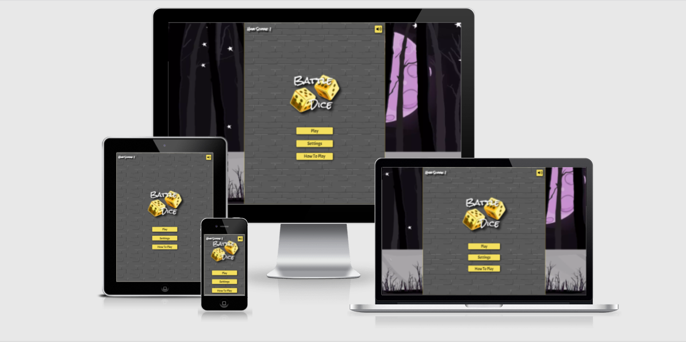
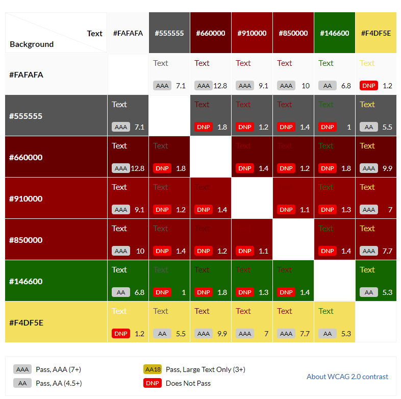

## **Project Overview**

The aim behind this project is to demonstrate my skills in the following areas:

- Design, develop and implement a dynamic Frontend web application using HTML, CSS and JavaScript.

- Implement Frontend interactivity, using core JavaScript, JavaScript libraries and/or Application Programming Interfaces (APIs).

- Test an interactive frontend web application throughout the development, implementation and deployment stages.

- Deploy an interactive Frontend web application to a Cloud platform.

- Demonstrate and document the development process through a version control system such as GitHub.

## User Experience (UX)

- ### User stories

  - #### First Time Visitor Goals

    - As a first time visitor, I want to be able to clearly understand the purpose of the site.

    - As a first time visitor, I want to be able to understand the rules of the game.

    - As a first time visitor, I want to play the game.

  - #### Returning Visitor Goals

    - As a returning visitor, I want to be able to play a different character.

  - #### Frequent User Goals
    - As a frequent user, I want to be able to see my high score.

- ### Design

  - #### Colour Scheme
  - -  `#fafafa`
  - -  `#555555`
  - -  `#660000`
  - -  `#910000`
  - -  `#850000`
  - -  `#146600`
  - -  `#f4df5e`

- These are the main colours used throughout the project, and contrast was checked between the different colours using a [Contrast Grid](https://contrast-grid.eightshapes.com/).
  

- #### Typography
    - Two fonts are used throughout the project, Acme is used for all main text and buttons. With Rock Salt being used for headings. Sans Serif as the fallback font in case for any reason the font is not being imported into the site correctly.

- #### Imagery
    - Imagery is especially important in this project, the log is designed to be inviting and also depicting what the game is based around. The background image for each section was chosen because it offers a nice theme and does not distract the user from the games main components. On larger screens the body has a more complex background, chosen to bring some colour to the page, while still not distracting the user from game elements, and helps tie the whole theme together.

- ### Wireframes

To organize and streamline the development process, I created wireframes for this project, to help me during the development process and to prevent scope creep.

Below are links to each wireframe page of the project, created to cover both Mobile and Desktop versions.

- #### Mobile:

  - [Main Menu](doc/wireframes/mobile/MainMenu.png)
  - [Settings Menu](doc/wireframes/mobile/Settings.png)
  - [How To Play Menu](doc/wireframes/mobile/HelpRules.png)
  - [Gameplay Start](doc/wireframes/mobile/GameStart.png)
  - [Gameplay Round Result](doc/wireframes/mobile/GameRoundResult.png)
  - [Gameplay End](doc/wireframes/mobile/GameEnd.png)

- #### Desktop:
  - [Main Menu](doc/wireframes/desktop/MainMenu.png)
  - [Settings Menu](doc/wireframes/desktop/Settings.png)
  - [How To Play Menu](doc/wireframes/desktop/HelpRules.png)
  - [Gameplay Start](doc/wireframes/desktop/GameStart.png)
  - [Gameplay Round Result](doc/wireframes/desktop/GameRoundResult.png)
  - [Gameplay End](doc/wireframes/desktop/GameEnd.png)

## Features

- Responsive on all device sizes
- Interactive elements

## Technologies Used

### Languages Used

- [HTML5](https://en.wikipedia.org/wiki/HTML5)
- [CSS3](https://en.wikipedia.org/wiki/Cascading_Style_Sheets)
- [JS](https://en.wikipedia.org/wiki/javascript)

### Frameworks, Libraries & Programs Used

1. ## [Google Fonts:](https://fonts.google.com/)
   - [Acme](https://fonts.google.com/specimen/Acme?query=acm)
   - [Rock Salt](https://fonts.google.com/specimen/Rock+Salt?query=rock+salt)
1. ## [Font Awesome:](https://fontawesome.com/)
   - Font Awesome was used for button icons, specifically on audio control elements. These icons were used for aesthetic and UX purposes.
1. [Git](https://git-scm.com/)
   - Git was used for version control by utilizing the Gitpod terminal to commit to Git and Push to GitHub.
1. [GitHub:](https://github.com/)
   - GitHub is used to store the projects code after being pushed via Git.
1. [Balsamiq:](https://balsamiq.com/)
   - Balsamiq was used to create the wireframes during the design process.

# Testing

Testing has been documented separately, please see the Testing documentation linked below:

- [Testing Documentation](doc/testing/TESTING.md)

## Deployment

### GitHub Pages

The project was deployed to GitHub Pages using the following steps...

1. Log in to GitHub and locate the [GitHub Repository](https://github.com/)
2. At the top of the Repository (not top of page), locate the "Settings" Button on the menu.
3. Scroll down the Settings page until you locate the "GitHub Pages" Section.
4. Under "Source", click the dropdown called "None" and select "Master Branch".
5. The page will automatically refresh.
6. Scroll back down through the page to locate the now published site [link](https://github.com) in the "GitHub Pages" section.

### Forking the GitHub Repository

By forking the GitHub Repository we make a copy of the original repository on our GitHub account to view and/or make changes without affecting the original repository by using the following steps...

1. Log in to GitHub and locate the [GitHub Repository](https://github.com/)
2. At the top of the Repository (not top of page) just above the "Settings" Button on the menu, locate the "Fork" Button.
3. You should now have a copy of the original repository in your GitHub account.

### Making a Local Clone

1. Log in to GitHub and locate the [GitHub Repository](https://github.com/)
2. Under the repository name, click "Clone or download".
3. To clone the repository using HTTPS, under "Clone with HTTPS", copy the link.
4. Open Git Bash
5. Change the current working directory to the location where you want the cloned directory to be made.
6. Type `git clone`, and then paste the URL you copied in Step 3.

```
$ git clone https://github.com/YOUR-USERNAME/YOUR-REPOSITORY
```

7. Press Enter. Your local clone will be created.

```
$ git clone https://github.com/YOUR-USERNAME/YOUR-REPOSITORY
> Cloning into `CI-Clone`...
> remote: Counting objects: 10, done.
> remote: Compressing objects: 100% (8/8), done.
> remove: Total 10 (delta 1), reused 10 (delta 1)
> Unpacking objects: 100% (10/10), done.
```

## Credits


### Code

- All code was written and validated by the developer


### Media

- Boss and Player character images from [OpenGameArt](https://opengameart.org/):
    - "Cute Boss Monsters" by [Justin Nichol](https://opengameart.org/users/justin-nichol) licensed CC-BY 3.0, CC-BY 4.0.

- Music from [OpenGameArt](https://opengameart.org/): 
    - Battle Theme A - "The Battle Of Darkness" by [Fato_Shadow](https://opengameart.org/users/fatoshadow) licensed CC-BY 3.0. CC-BY-SA 3.0, GPL 3.0 GPL 2.0.

    - Battle Theme B - "Orchestral Battle Music" by [Zefz](https://opengameart.org/users/zefz) licensed CC-BY-SA 3.0 GPL 3.0.

    - Battle Theme C - "Battle in the winter" by [Jobromedia](https://opengameart.org/users/jobromedia) licensed CC-BY 3.0, GPL 3.0, CC-BY 3.0.

    - Battle Theme D - "Colossal Boss Battle Theme" by [Matthew Pablo](https://opengameart.org/users/matthew-pablo) licensed CC-BY 3.0.

    - Battle Theme E - "Battle Theme A" by [cynicmusic](https://opengameart.org/content/battle-theme-a#:~:text=Author%3A%C2%A0-,cynicmusic,-Sunday%2C%20December%2015) licensed CC0.

    - Death Theme  - "Death Is Just Another Path" by [Otto Halmén](https://opengameart.org/users/otto-halm%C3%A9n) licensed CC-BY 3.0. OGA-BY 3.0.

    - Victory Theme -  "Lively Meadow (Victory Song)" by [Matthew Pablo](https://opengameart.org/users/matthew-pablo) licensed  CC-BY 3.0.

    - Victory Fanfare - "Lively Meadow (Victory Fanfare)" by [Matthew Pablo](https://opengameart.org/users/matthew-pablo) licensed  CC-BY 3.0.

- SFX from [OpenGameArt](https://opengameart.org/): 
    - Dice Roll 1-4 - "Wooden dice on wooden table roll" by [Wuzzy](https://opengameart.org/users/wuzzy) licensed CC0.

- Backgrounds from [OpenGameArt](https://opengameart.org/): 
    - Body Background - "3 Parallax Backgrounds" by [Mobile Game Graphics](https://opengameart.org/users/mobile-game-graphics) licensed GPL 3.0.
    - Section Background - "Seamless Wall" by [GrumpyDiamond](https://opengameart.org/users/grumpydiamond) licensed CC0.

- Dice Images from [OpenGameArt](https://opengameart.org/): 
    - Dice Side Images - "Dice" by [JamesWhite](https://opengameart.org/users/jameswhite) licensed CC0.

- Dice Logo from [PNGITEM](https://www.pngitem.com/middle/wmoww_x-gold-clipart-transparent-gold-dice-png-png/):
    - Dice Logo - "Transparent Gold Dice Png" by [Umatiya Said](https://www.pngitem.com/userpic/14100/)
### Acknowledgements

- My Mentor for continuous helpful feedback.

- Tutor support at Code Institute for their support.
